# Color Primer

## What is color?
- **Physical**: Light with a spectrum of wavelengths.
- **Perceptual**: Human vision reduces spectra to three responses (cones), so colors are modeled as 3‑component vectors.

## What is a color space?
- A **coordinate system** for color.
- Defines primaries (or axes), white point, and a transfer/gamma function.
- Examples: sRGB, Display P3, Rec.2020, XYZ, Lab, OKLab.

## What is a color gamut?
- The **range of colors** a space or device can represent.
- Visualized as a volume in a reference space (e.g., XYZ or Lab/OKLab).
- Converting from a larger to a smaller gamut can cause clipping or compression.

## What is a reference space?
- A common hub for conversions between spaces.
- **In this library:** single reference = **CIE XYZ (D65)**. All inter-space conversions go through XYZ (with chromatic adaptation if needed).
- Working/perceptual space for operations: **OKLCH** (for lighten/darken/saturate), but conversions still route through XYZ.

## What are perceptual color spaces?
- Spaces designed for more uniform perceptual distances.
- **OKLab / OKLCH** (modern, recommended), **Lab / LCH** (classic).
- Benefits: smoother gradients, better “evenness” of lightness/saturation adjustments.

## Color spaces and gamuts we support
- **RGB spaces (with explicit primaries/transfer):**
  - sRGB, sRGB-linear
  - Display P3
  - Adobe RGB (a98-rgb)
  - ProPhoto RGB
  - Rec. 2020
- **CIE / perceptual:**
  - XYZ (D65 reference)
  - Lab / LCH
  - OKLab / OKLCH
- **Legacy parameterizations (sRGB-based):**
  - HSL, HSV

## Where conversions can be lossy
- **Gamut reduction:** converting wide-gamut (P3/2020/ProPhoto) to sRGB (e.g., `ToRGBA()`).
- **Explicit ConvertTo to a smaller gamut** (out-of-gamut values clip/compress).
- **Metadata loss** if using the legacy `Color` interface that assumes sRGB.
- **Quantization** if exporting to 8-bit or YCbCr video ranges (not enabled by default here).

## Gradients: why space matters
- Same stops, different results:
  - **RGB:** non-uniform, can “dip” or “bunch.”
  - **HSL:** hue-based; lightness may feel uneven.
  - **Lab/LCH:** more uniform than RGB/HSL.
  - **OKLab/OKLCH:** most uniform (recommended).
- Recommendation: Generate gradients in **OKLCH** (or OKLab) for perceptual smoothness.

### Example: gradients in different spaces
```go
red := color.RGB(1, 0, 0)
blue := color.RGB(0, 0, 1)

// Perceptually uniform (recommended)
gOKLCH := color.GradientInSpace(red, blue, 10, color.GradientOKLCH)

// HSL (hue-based)
gHSL := color.GradientInSpace(red, blue, 10, color.GradientHSL)

// RGB (fast, not uniform)
gRGB := color.GradientInSpace(red, blue, 10, color.GradientRGB)
```

## Visual Examples

### Chromaticity Diagrams

Chromaticity diagrams show the color gamut of each RGB color space projected onto the CIE xy chromaticity plane. The horseshoe-shaped curve represents the spectral locus (pure spectral colors), and the triangle shows the gamut boundary of each RGB space.

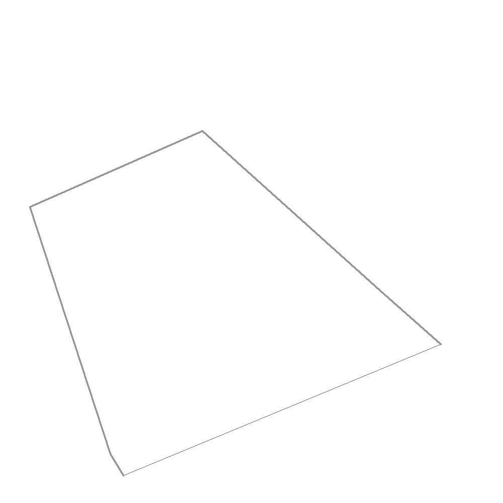
*sRGB chromaticity diagram - shows the gamut triangle within the visible color spectrum*

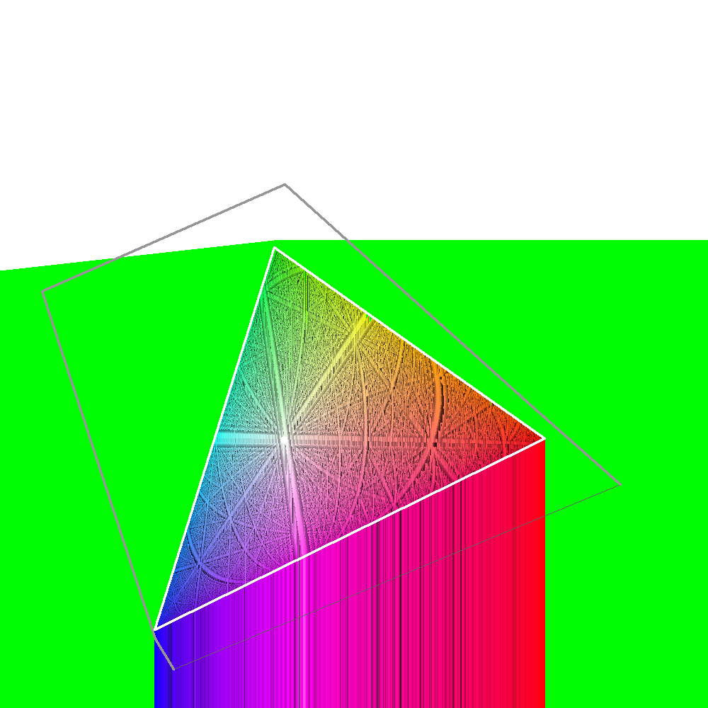
*Display P3 chromaticity diagram - wider gamut than sRGB*


*Adobe RGB chromaticity diagram - wider gamut, especially in cyan-green*

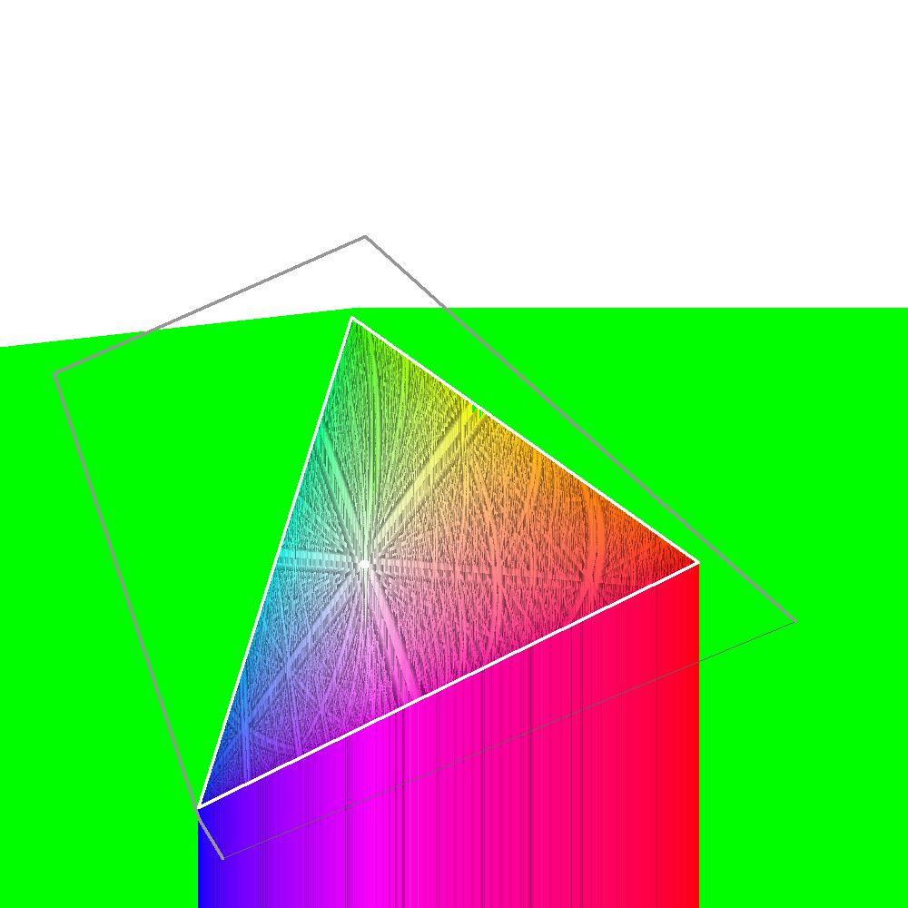
*Rec. 2020 chromaticity diagram - very wide gamut for future display technologies*

### Gamut Volumes

The following images show the 3D volume of each color space's gamut in an isometric projection. Each gamut represents the complete range of colors that can be represented in that space. Images are provided in both light and dark mode variants for responsive documentation.

#### sRGB Gamut
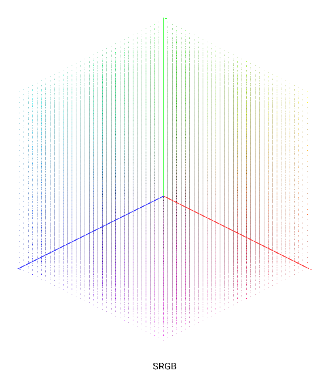

*sRGB gamut - the standard web color space*

#### Display P3 Gamut
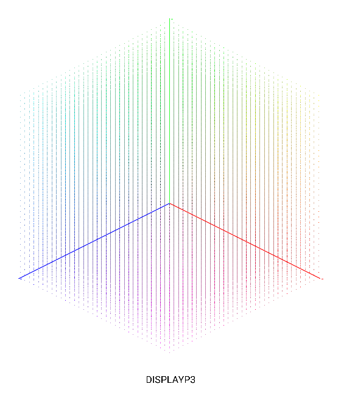
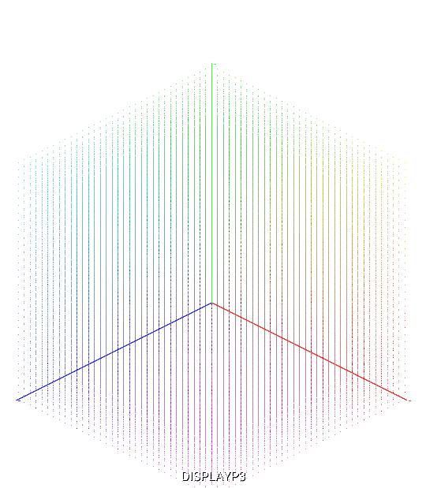
*Display P3 gamut - wider than sRGB, especially in greens and reds*

#### Adobe RGB Gamut
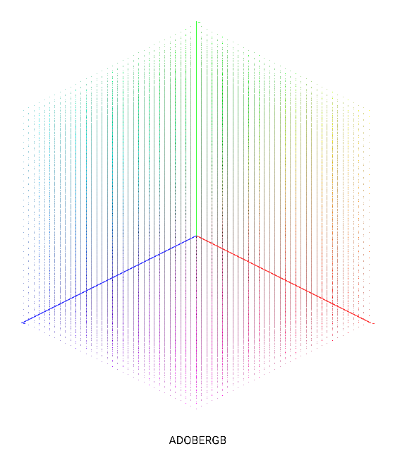
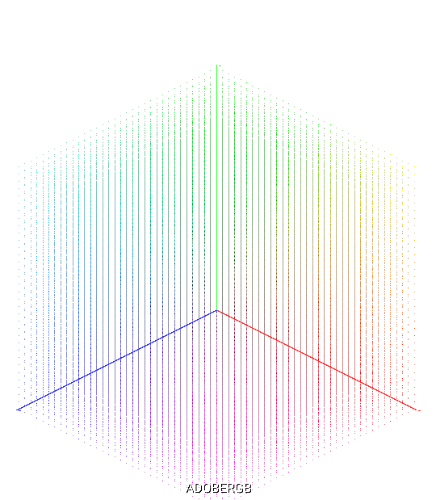
*Adobe RGB gamut - wider than sRGB, particularly in cyan-green*

#### Rec. 2020 Gamut
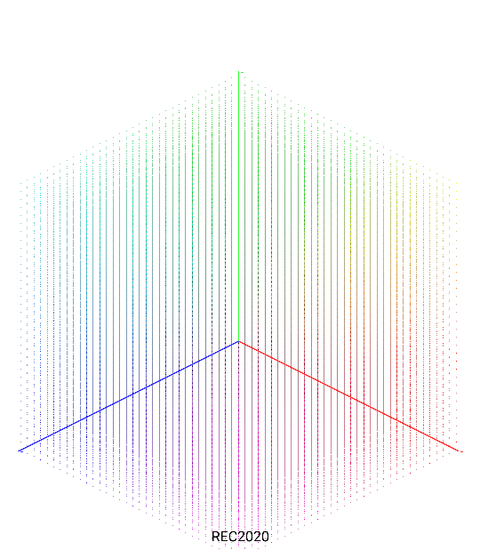
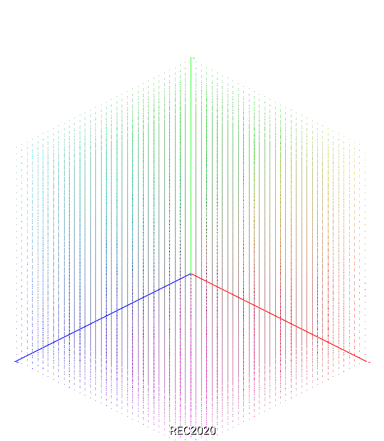
*Rec. 2020 gamut - very wide, designed for future display technologies*

### Color Model Visualizations

The following diagrams illustrate how different color models represent the color space. Each model has a different geometric structure that affects how colors are organized and interpolated.

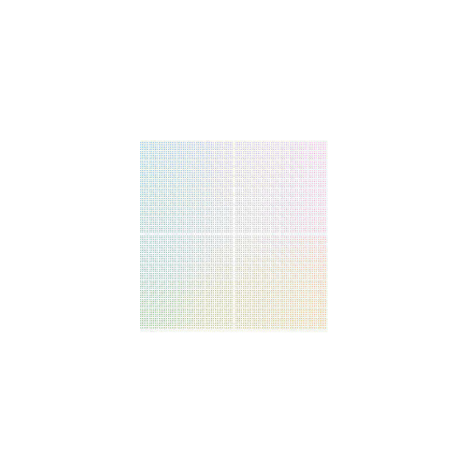
*RGB color model - cubic structure with red, green, and blue axes*

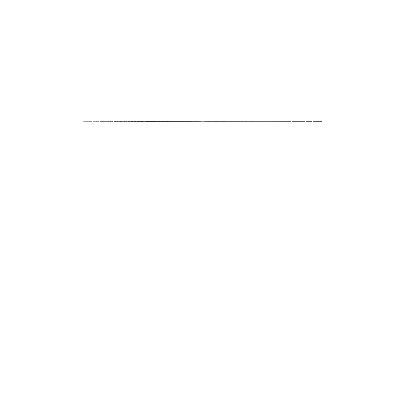
*HSL color model - cylindrical structure with hue around the circumference, saturation as radius, and lightness as height*

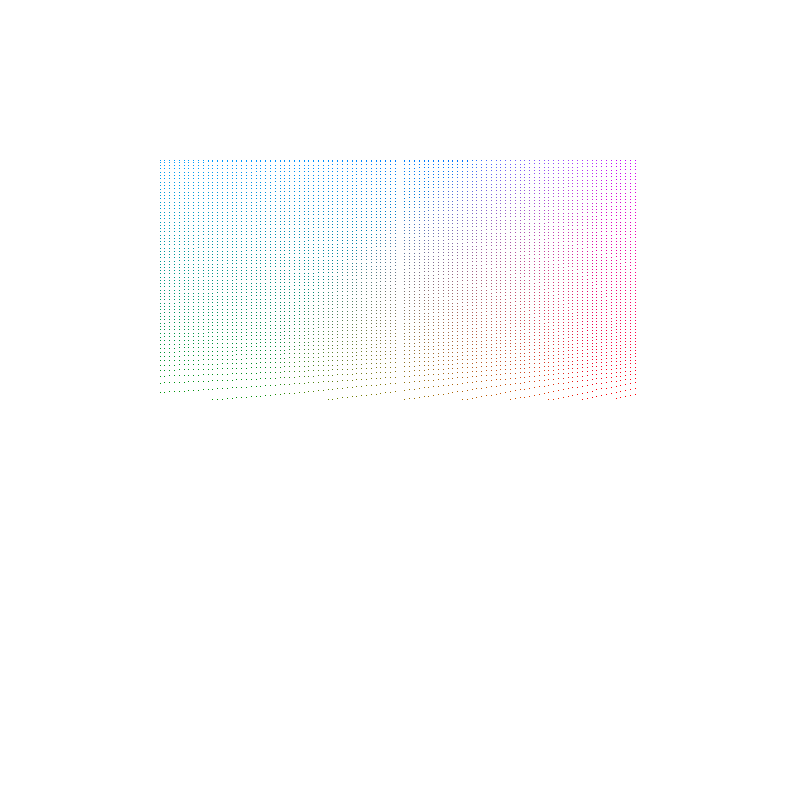
*LAB color model - perceptually uniform space with L (lightness), A (green-red), and B (blue-yellow) axes*

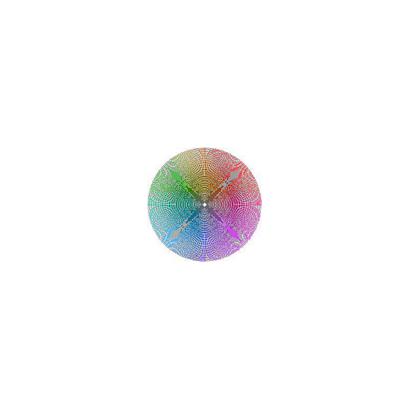
*OKLCH color model - modern perceptually uniform cylindrical space with L (lightness), C (chroma), and H (hue)*

### Gradient Comparisons

The following images demonstrate how the same color stops (red to blue) appear when interpolated in different color spaces. Notice how RGB and HSL produce less uniform transitions, while OKLCH produces the smoothest, most perceptually uniform gradient.

<picture>
  <source media="(prefers-color-scheme: dark)"  srcset="docs/gradients/stops_white.png">
  <source media="(prefers-color-scheme: light)" srcset="docs/gradients/stops_black.png">
  
</picture>  

*Start (red) and end (blue) color stops with hex codes*

<picture>
  <source media="(prefers-color-scheme: dark)"  srcset="docs/gradients/gradient_rgb_white.png">
  <source media="(prefers-color-scheme: light)" srcset="docs/gradients/gradient_rgb_black.png">
  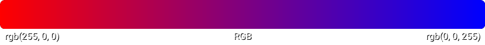
</picture>  

*RGB interpolation - notice the "muddy" middle section and uneven transitions*


<picture>
  <source media="(prefers-color-scheme: dark)"  srcset="docs/gradients/gradient_hsl_white.png">
  <source media="(prefers-color-scheme: light)" srcset="docs/gradients/gradient_hsl_black.png">
  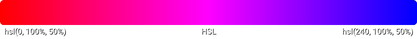
</picture>  

*HSL interpolation - hue-based, but lightness may feel uneven*


<picture>
  <source media="(prefers-color-scheme: dark)"  srcset="docs/gradients/gradient_lab_white.png">
  <source media="(prefers-color-scheme: light)" srcset="docs/gradients/gradient_lab_black.png">
  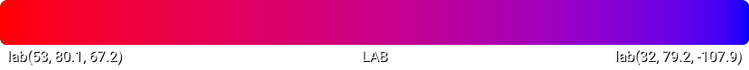
</picture>  

*LAB interpolation - more perceptually uniform than RGB/HSL*


<picture>
  <source media="(prefers-color-scheme: dark)"  srcset="docs/gradients/gradient_oklab_white.png">
  <source media="(prefers-color-scheme: light)" srcset="docs/gradients/gradient_oklab_black.png">
  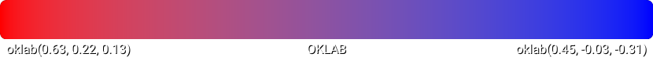
</picture>  

*OKLAB interpolation - modern, perceptually uniform space*


<picture>
  <source media="(prefers-color-scheme: dark)"  srcset="docs/gradients/gradient_lch_white.png">
  <source media="(prefers-color-scheme: light)" srcset="docs/gradients/gradient_lch_black.png">
  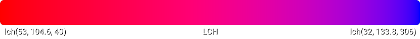
</picture>  

*LCH interpolation - cylindrical representation of LAB*


<picture>
  <source media="(prefers-color-scheme: dark)"  srcset="docs/gradients/gradient_oklch_white.png">
  <source media="(prefers-color-scheme: light)" srcset="docs/gradients/gradient_oklch_black.png">
  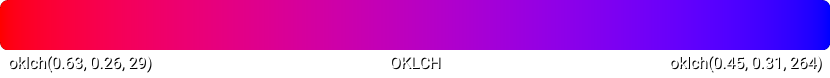
</picture>  

*OKLCH interpolation - **recommended** for perceptually uniform gradients*


### Generated Assets

All visualizations are generated programmatically:
- `docs/chromaticity/`: CIE xy chromaticity diagrams for sRGB, Display P3, Adobe RGB, Rec. 2020 (via `cmd/generate_chromaticity`)
- `docs/gamuts/`: Isometric 3D volume visualizations for sRGB, Display P3, Adobe RGB, Rec. 2020 with labels, in both light and dark mode variants (via `cmd/generate_gamuts`)
- `docs/gradients/`: Gradient strips in RGB, HSL, Lab, OKLab, LCH, OKLCH with transparent backgrounds and dual-text labels (via `cmd/generate_gradients`)
- `docs/gradients/stops_black.png` and `stops_white.png`: Color stop squares aligned to gradient width with black and white text variants (via `cmd/generate_stops`)
- `docs/models/`: Color model visualizations showing RGB cube, HSL cylinder, LAB space, and OKLCH space (via `cmd/generate_models`)

## Key takeaways
- Single reference hub: **XYZ (D65)**.
- Perceptual working space for operations: **OKLCH** (conversions still via XYZ).
- Explicit conversions only; data loss happens mainly on gamut reduction or legacy sRGB-only paths.

